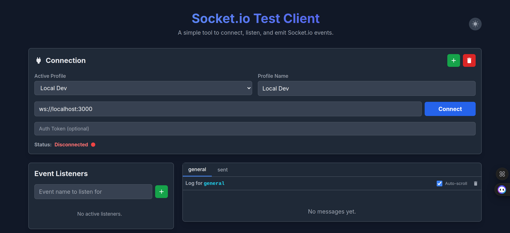
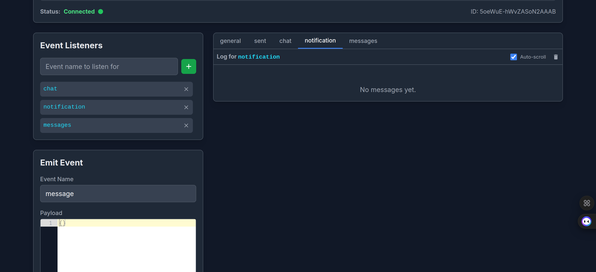

<div align="center">
   <h1>Socket.io Test Client</h1>
   <p><strong>Lightweight, reactive tool to connect, inspect, and emit <code>Socket.IO</code> events for backend debugging.</strong></p>
   <p>
      
   </p>
   <p>
      
   </p>
</div>

## Features

- 🔌 Multi‑profile connection manager (switch between endpoints quickly)
- 🔐 Optional token field (attach auth manually in your own logic layer if extended)
- 📡 Add & remove dynamic event listeners at runtime
- 📤 Emit events with JSON payload editor (validation feedback)
- 🧾 Structured message log grouped by event name
- 🎨 Light / dark theme toggle (CSS variables + Tailwind utility usage)
- ⚡ Fast Vite + React 19 + TypeScript stack
- ♻️ Persistent state via local storage (profiles, draft events, listeners)

## Tech Stack

| Layer | Choice |
|-------|--------|
| Build | Vite |
| Realtime | socket.io-client ^4.8.x |
| Language | TypeScript |

## Getting Started

### 1. Install

```bash
npm install
```

### 2. (Optional) Configure Site URL for SEO

Create a `.env` file (copy from `.env.example`):

```
VITE_SITE_URL=https://your-domain.com
```

### 3. Run Dev Server

```bash
npm run dev
```

Open the printed local URL (typically http://localhost:5173/).

### 4. Build for Production

```bash
npm run build
npm run preview
```

## Usage

1. Enter or select a connection profile URL (e.g. `ws://localhost:3000`).
2. Click Connect. Connection status + socket id will appear.
3. Add event names under Listeners to start capturing incoming messages.
4. Use the Emit form to send an event + JSON payload (editor helps formatting).
5. Clear messages from the log when needed.

## Project Structure (simplified)

```
src/
   components/       # UI pieces (ConnectionManager, EventSender, etc.)
   hooks/            # Custom hooks (useSocketManager, useLocalStorage)
   contexts/         # Theme context
   index.tsx         # App bootstrap
   App.tsx           # Composition root
public/             # Static assets (manifest, robots, sitemap)
docs/images/        # Documentation screenshots
```

## Environment Variables

| Name | Purpose | Required |
|------|---------|----------|
| `VITE_SITE_URL` | Inject canonical + og:url at runtime | No |

## SEO / Metadata

- Dynamic canonical + OpenGraph URL via `VITE_SITE_URL`.
- Structured data (SoftwareApplication) included.
- robots.txt + sitemap.xml generated manually (edit domain before deploying).

## Extending

Ideas:
- Add authentication headers injection before connecting.
- Persist logs to IndexedDB.
- Export / import profiles (JSON download).
- Add namespaces / rooms panel.

## Contributing

PRs welcome. Please keep components small & typed.

## License

MIT

## Author

Dagim Chernet

---

If this helps you debug realtime backends, consider starring the repository. ⭐
